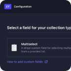
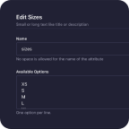
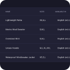
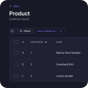
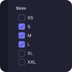

# Strapi Plugin: Multiselect Field

A custom field for Strapi that allows users to select multiple options from a predefined list.

## ⏳ Installation

Install with NPM.

```bash
npm install strapi-plugin-multiselect-field --save
```

Install with Yarn.

```bash
yarn add strapi-plugin-multiselect-field
```

## 🔧 Usage

### 1. Configure the Plugin

Add the following configuration to your `config/plugins.ts` file. Create the file if it doesn’t already exist:

```ts
export default {
  // …
  'multiselect-field': {
    enabled: true,
  },
};
```

Then restart the app to apply the changes.

### 2. Use in the Admin Panel

After installation, the **"Multiselect"** field will appear in the _Custom Fields_ section of the Content-Type Builder.

#### Adding Options

To define available options:

- Enter each option on a separate line in the **Available Options** field.

#### Custom Delimiter

You can specify a **custom delimiter** for storing the selected values in the database.

- For example, using the default delimiter `,` the API response will look like:  
  `Option-1,Option-2,Option-3`.

**Note:** The selected values are stored as a **plain string**, so you can **filter entries by any selected option** when viewing data in the list view in the admin panel.

## 📸 Screenshots

Below are screenshots from an example application where this plugin is used to select available product sizes.

<a href="./assets/content-type-builder-custom-fields.png"/></a>&nbsp;&nbsp;<a href="./assets/content-type-builder-multiselect-field.png"/></a>&nbsp;&nbsp;<a href="./assets/content-manager-list-view.png"/></a>&nbsp;&nbsp;<a href="./assets/content-manager-list-view-filtered.png"/></a>&nbsp;&nbsp;<a href="./assets/content-manager-edit-view.png"/></a>
